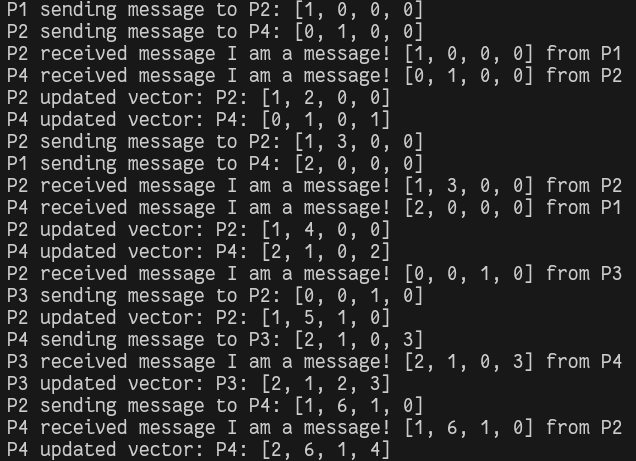

# Vetorial Clock

Simulating Vetorial Logic Clock syncronization.

## Running

Clone this repository:

```git clone https://github.com/noemyroberta/vetorial_clock.git```

Test it by placing the command below on project root:

```python3 main.py```

## Stopping

This project send async data on real time, to stop the program execution, please, consider entering:

```Ctrl + C```

## Expected Output

The screenshot below is the expected output for this project.


